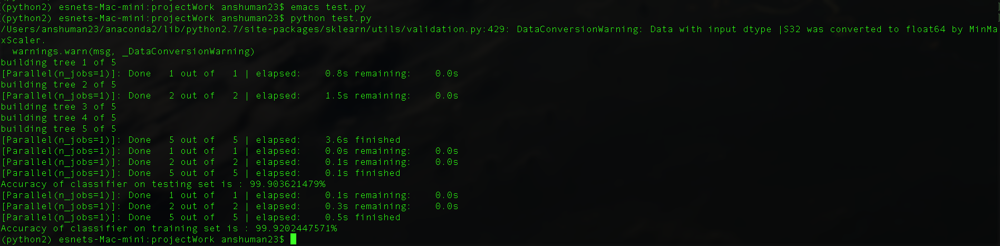

# Machine learning meetups at ESNet
**_1498478400 (UNIX timestamp) : Monday, 26th of July, 2017 - 12:00:00 PM_**

## Details 
- Repository contains : 
[x] Code for the session
[x] PDF file of slides
[x] Data used for training and testing (NIMS1)

## Dependencies
- ``` scikit-learn 1.8.0 ``` or higher
- ``` python 2 ```
- ``` arff ```
- ``` numpy ```

## Running it
- To run the code just type ```python rfc.py``` in terminal

## Accuracy output
 
